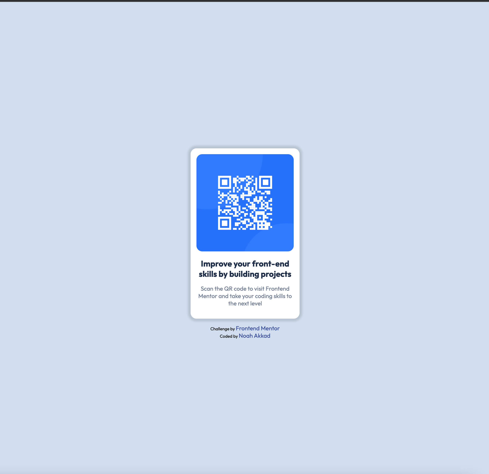
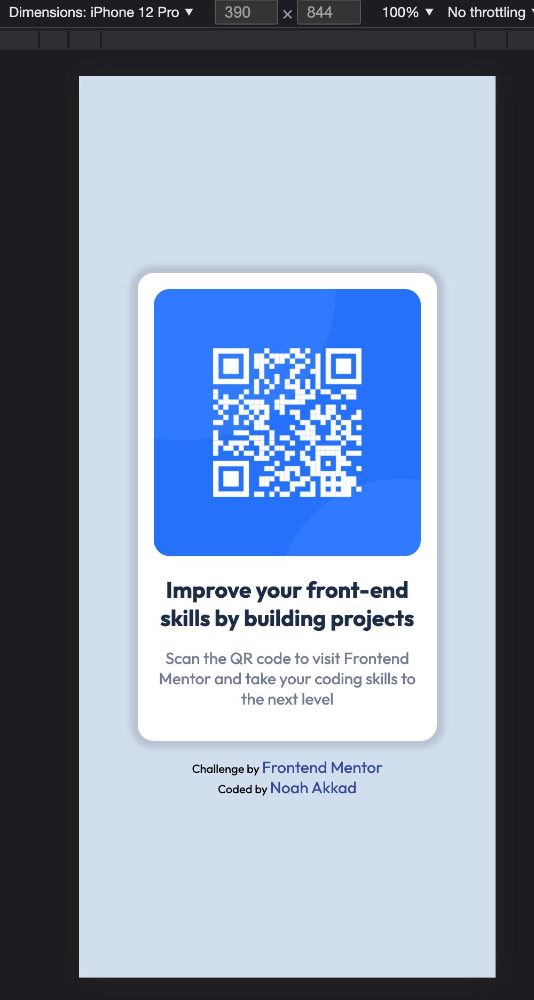

# Frontend Mentor - QR code component solution

This is a solution to the [QR code component challenge on Frontend Mentor](https://www.frontendmentor.io/challenges/qr-code-component-iux_sIO_H). Frontend Mentor challenges help you improve your coding skills by building realistic projects. 

## Table of contents

- [Overview](#overview)
  - [Screenshot](#screenshot)
  - [Links](#links)
- [My process](#my-process)
  - [Built with](#built-with)
  - [What I learned](#what-i-learned)
  - [Continued development](#continued-development)
  - [Useful resources](#useful-resources)
- [Author](#author)
- [Acknowledgments](#acknowledgments)

## Overview

### Screenshot




### Links

- Solution URL: (https://github.com/NoahAkkad/qr-code-component-main)
- Live Site URL: (https://noahakkad.github.io/qr-code-component-main)

## My process

### Built with

- Semantic HTML5 markup
- CSS custom properties
- Flexbox


### What I learned

For me, it was very easy because of dealing with Flexbox. I hope to learn JavaScript quickly in order to make a QR generator.


```css
body {
  display: flex;
  flex-direction: column;
  align-items: center;
  justify-content: center;
  height: 100vh
}
```

### Continued development

I will try to complete all the challenges and learn JavaScript


## Author

- Website - [Noah Akkad](https://github.com/NoahAkkad)
- Frontend Mentor - [@NoahAkkad](https://www.frontendmentor.io/profile/NoahAkkad)
- Twitter - [@NoahAkkad](https://twitter.com/NoahAkkad)

